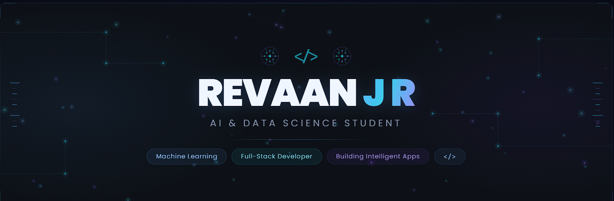

  

<h1 align="center">Hi 👋 I'm Revaan J R</h1>

<h3 align="center">
Artificial Intelligence • Machine Learning • Full-Stack Development
</h3>

Building intelligent software through AI, innovation, and modern technologies.

---
# 👨‍💻 About Me

<table>
<tr>

<td width="58%">

🎓 **B.Tech Artificial Intelligence & Data Science**

🏫 **Madras Institute of Technology (MIT), Chennai**

💻 Passionate about **Machine Learning, Full-Stack Development, Computer Vision, and Generative AI**

🚀 I enjoy building AI-powered applications that solve real-world problems through intelligent software and modern technologies.

### 🚀 Currently Working On

- 🤖 AI-Powered Full-Stack Applications
- 🧠 Machine Learning & Generative AI
- 💻 Data Structures & Algorithms
- 🌐 Interactive Web Applications
- 📈 Real-World AI Solutions

</td>

<td width="42%">

</td>

</tr>
</table>

# 🛠️ Tech Stack

---

# 🚀 Featured Projects

| 🚀 Project | Description |
|------------|-------------|
| 📚 **AI E-Book Creator** | AI-powered platform for generating intelligent e-books using Generative AI. |
| 🐠 **Smart Aquarium Monitoring System** | IoT-based real-time monitoring and automation system. |
| 🏦 **Bank Management System** | Secure banking application for customer and transaction management. |
| 🧩 **Sliding Puzzle Solver** | Interactive visualization implementing BFS, DFS, and A* Search Algorithms. |
| 🎨 **Graph Coloring Visualizer** | Interactive Greedy Graph Coloring visualization for Constraint Satisfaction Problems. |

---

# 🎯 Areas of Interest

🧠 Artificial Intelligence

🤖 Machine Learning

👁️ Computer Vision

✨ Generative AI

🌐 Full-Stack Development

📱 Internet of Things (IoT)

📊 Data Science

---

# 📊 GitHub Analytics

---

# 🔥 GitHub Streak

---

# 🏆 GitHub Achievements

---

# 📈 Contribution Graph

---

# 💡 Quote

> **"Code with purpose. Build with intelligence. Learn without limits."**

---

<h3 align="center">⭐ Thanks for visiting my profile! ⭐</h3>
